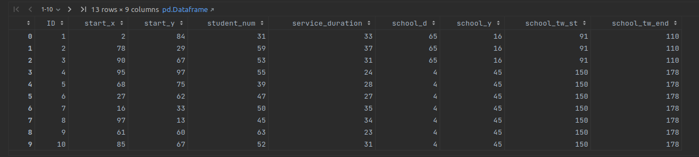

# msci434-final-project
🚌🚌🚌🚌🚌🚌🚌🚌🚌

## Scripts

Export current pip reqs to requirements.txt
```sh
pip freeze > requirements.txt
```

## Data



- ID: route segment identity index
- start_x, start_y: coordinate of the first stop of the route segment
- student_num: number of students that served by the route segment
- service_duration: service time of the route segment. It includes students’ pick-up time, traveling time, and unloading time at the destination
- school_x, school_y: coordinate of the destination school of the route segment
- school_tw_st, school_tw_end: time window of the school. Route segment’s service should be completed within the time window.
